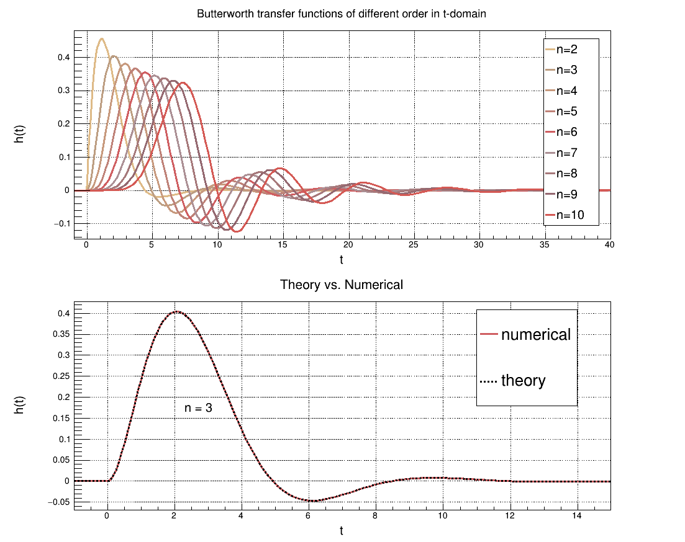

# Butterworth filter transfer function in *t*-domain
This projecti is implementation of [Butterworth](https://en.wikipedia.org/wiki/Butterworth_filter) filter transfer function in *t*-domain as a [RooFit](https://root.cern.ch/roofit) `RooAbsReal` class.

# Test plots

  

</img></img>

