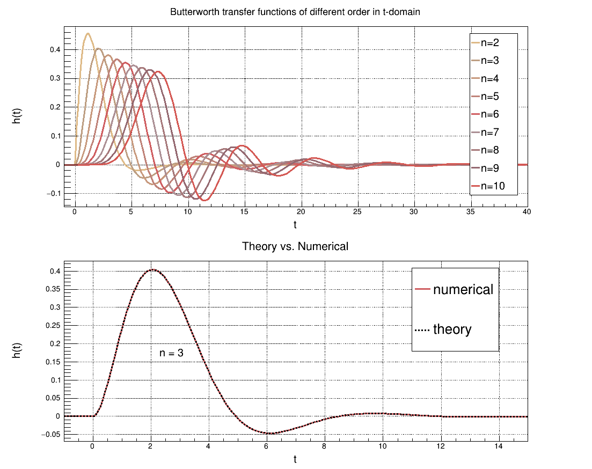

# Butterworth filter transfer function in *t*-domain
This project is implementation of [Butterworth](https://en.wikipedia.org/wiki/Butterworth_filter) filter transfer function in *t*-domain as a [RooFit](https://root.cern.ch/roofit) `RooAbsReal` class.

# StackExchange thread
[This](https://dsp.stackexchange.com/questions/63780/butterworth-filter-transfer-function-in-time-domain/63785?noredirect=1#comment129561_63785) Signal Processing SE thread is devoted to the Butterworth transfer function in *t*-domain and provides a lot of useful information.

# Test plots
In the abovementioned SE thread `Ed V` provided analytical expression of *h(t)* of the order 3. I used this fact to check my algorithm:

  
  

</img></img>

